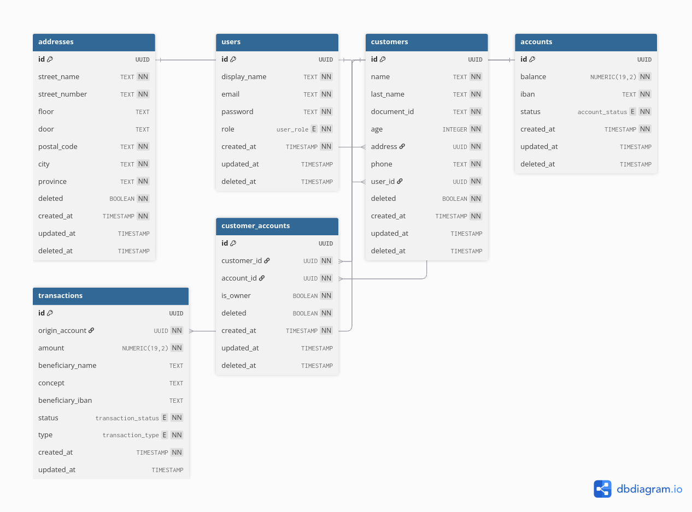

FBank API 🏦
============

FBank is a backend I built to practice Spring Boot while working on something closer to a real-world project. It manages customers, their bank accounts, and the relations between them. I also wanted to explore Spring Security with JWT and role-based access. All data is stored in PostgreSQL.

Key Features
------------

*   Authentication and roles handled with Spring Security + JWT
*   Create and manage customers and accounts (including joint accounts)
*   Validation for emails, NIFs, and IBANs with error messages
*   Swagger UI to explore and test the API
*   Unit and integration tests with JUnit 5 + Testcontainers (no need for a local test DB)

  
ERD Diagram
------------

Quick Start
-----------

Clone the repo:

    git clone https://github.com/eaomarb/fbank-api.git
    cd fbank-api
    

Set up PostgreSQL (Docker or local). Example credentials:

*   DB: fbank
*   User: testuser
*   Password: testpass

Update `application.properties` with your database info and a JWT secret key.

Build and run the app:

    ./mvnw clean install -Dspring.profiles.active=test
    ./mvnw spring-boot:run
    

Open Swagger UI:  
[http://localhost:8080/swagger-ui/index.html](http://localhost:8080/swagger-ui/index.html)

Project Structure
-----------------

* account/ – Bank account logic
* customer/ – Customer data and validation
* customeraccount/ – Links customers with accounts
* user/ – Users, roles, and permissions
* address/ – Customer addresses
* auth/ – Login and JWT handling
* config/ – App and security configuration

Testing
-------

Tests are written with JUnit 5 and Testcontainers, so you don’t need to configure a separate DB manually.

**Note:** To run all tests without errors, use the `test` profile:

    ./mvnw clean install -Dspring.profiles.active=test
    

Running tests directly from the IDE works fine, but when using Maven (`mvn clean install`) you need the `test` profile.

Docker Setup 🐳
---------------

**Port:** 8080

**Required environment variables:**

*   DB\_HOST – PostgreSQL host
*   DB\_PORT – PostgreSQL port (default 5432)
*   DB\_NAME – database name
*   DB\_USERNAME – database user
*   DB\_PASSWORD – database password
*   JWT\_SECRET – JWT secret key

Example Dockerfile:

    FROM eclipse-temurin:21
    ARG JAR_FILE=target/*.jar
    COPY ./target/fbank-1.0.0.jar app.jar
    ENTRYPOINT ["java","-jar","/app.jar"]
    

Running the app
---------------

1. Build the project: `./mvnw clean install -Dspring.profiles.active=test`
2. Run locally: `./mvnw spring-boot:run`
3. Or with Docker: `docker build -t fbank-api . && docker run -d -p 8080:8080 --name fbank-api fbank-api`

Set your DB and JWT environment variables before running Docker.
    

Docker Compose example:

    services:
      fbank:
        image: fbank-api
        build: .
        ports:
          - "8080:8080"
        environment:
          DB_HOST: db
          DB_PORT: 5432
          DB_NAME: fbank
          DB_USERNAME: testuser
          DB_PASSWORD: testpass
          JWT_SECRET: changeme
      db:
        image: postgres:15
        environment:
          POSTGRES_DB: fbank
          POSTGRES_USER: testuser
          POSTGRES_PASSWORD: testpass
        ports:
          - "5432:5432"

Notes
-------------------

*   Currently only backend; frontend is planned but not done yet

Contact ✉️
----------

If you want to suggest improvements or ask something, please open an issue here in GitHub.
